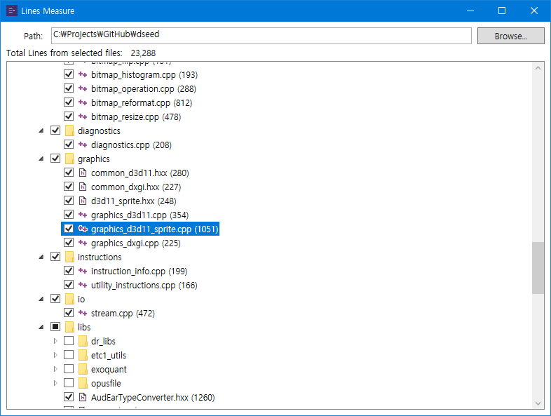

# Lines-Measure
The Successor of [Daram Line Counter](https://github.com/daramkun/DaramLineCounter).

## Screenshot

## Feature
* Selected files' total lines measuring.

## Goals
* Optimizing memory and performance.
* Auto exclude files by reference .gitignore file.
* Localization.
* Apply Simplify UI.
* Support Multi-platforms.